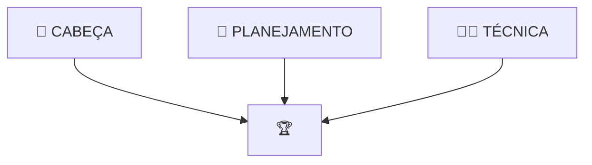

# **GUIA: COMO ESTUDAR PARA FATEC 2025**!
   
Com a mudança da banca que aplica a prova da FATEC que aconteceu em 2025 a forma de se preparar para a FATEC mudou e a ideia desse nosso conteúdo é te explicar como essa mudança de banca impacta no seu processo de estudo e te mostrar os 3 pilares que devem nortear sua preparação para FATEC! 

??? warning "Atenção: Não pule conteúdo"
	Muitas pessoas começam a se preparar para a prova da FATEC faltando apenas algumas semanas para prova e é natural querer correr para assistir apenas o essencial, mas toda a lógica desse conteúdo vai te ajudar na construção do seu plano de estudo, especialmente se você tiver pouco tempo, então evite pular os conteúdos que vamos falar por aqui! 

---
## **Entendendo a mudança**

### **O que gerou essa mudança?**
**DA FAT PARA IDECAN**  
Para quem não sabe até 2024 a instituição responsável pela prova da FATEC era a [Fundação FAT](https://fundacaofat.org.br/){.:target="_blank"} . A partir de 2025, isso mudou e a [IDECAN](https://www.idecan.org.br/){.:target="_blank"}  passou a ser responsável pela aplicação. 

### **O mudou na prova?**  
O conteúdo cobrado, segundo o edital da FATEC mudou pouco da FAT para IDECAN, no entanto, a maneira como esse conteúdo é cobrada mudou drasticamente, enquanto nas provas da FAT a interpretação era um muito presente, sendo possível acertar muitas questões da prova apenas lendo e interpretando os textos, a IDECAN vem com uma abordagem muito mais focada em conteúdos específicos. 
Essa mudança gerou uma surpresa muito grande para quem foi realizar o vestibular do 1º Semestre de 2025, mas o fato aqui é a prova mudou e a forma de se preparar também!

### **O muda na preparação?**  
Devido a dinâmica da prova antiga da FATEC a preparação que sempre recomendei no canal foi focada em realizar as provas antigas, essa estratégia funcionava muito bem para prova da FAT que tinha muita interpretação, afinal resolver as provas antigas era uma das melhorar formas de treinar interpretação. Com essa nova prova precisamos de um estudo que não foca apenas em interpretação, mas também em aprender os conteúdos que a prova apresenta, e é sobre isso que vamos valar agora

---
## **Como se preparar para nova FATEC**

### **Os 3 pilares da preparação**

A sua preparação para fatec passa por 3 pilares:

- Planejamento

- Técnica

- Cabeça

Aqui a ideia é explicar a lógica por trás de cada um dos três e apresentar para vocês o principio geral de cada um deles! 

No final desse conteúdo você saberá:  


- [ ] Montar meu planejamento de estudo
- [ ] Definir o que estudar
- [ ] Descobrir como vencer a procrastinacao

---
### **📅 Planejamento**
??? tip "Principio"
	O planejamento só é necessário por que nosso tempo estudando para FATEC não é inifinito.

O pilar de planejamento é o responsável por responder perguntas como: 

- Quantas preciso estudar por dia?

- Quantas horas estudar por matéria?

- Quanto tempo estudar matérias novas? E revisões? E provas antigas?

- Por qual conteúdo começo a estudar Português? E mamtemática? E ...

- Como divido meu tempo se tenho 6 meses pra estudar? E se tenho 1 mes? E uma semana? 


Essas perguntas ajudam a ilustar qual parte do nosso estudo esse pilar cuida, e a resposta para cada uma delas daria um vídeo, mas pra entender a ideia geral você precisa ter duas coisas em mente: 

---
**MONTANDO SEU 1º PLANEJAMENTO**

**1. Comece simples:** Quando falamos de planejamento de estudo as pessoas tendem a querer complicar, com técnicas, métodos, formas de organização que pra quem está começando acabam mais dificultando do que ajudando, então comece da maneira mais simples possível

**2. Kaizen:** Para quem não conhece a filosifia Kaizen fala da melhoria continua e esse deve ser seu foco nos estudos ir melhorando gradualmente seu planejamento, sua organização, suas técnicas e sua mentalidade todo dia! 

---
**COMO COMEÇAR?**    
Seguindo a filosofia de comecar simples, pegue um papel e uma caneta e faça o seguinte, pensando na semana atual e na próxima semana:

1. **Liste seus compromissos recorrentes** Aquelas coisas que você faz toda semana (Ex: Trabalho, academia, cursos, etc.)

2. **Lista seus compromissos pontuais:** Aqueles compromissos fora da sua rotina que acontecem de vez em quanto (Ex: Médico, viagem, etc.)

3. **Encontre seus horários fixos de estudo:** Esses são os horários que você vai sentar e estudar para FATEC (Idealmente blocos de pelo menos 30 min)

4. **Tente seguir esses horários:** Todo dia anote se você conseguiu ou não seguir os horários e se não conseguiu o motivo, no fim da semana, volte para o passo 1 e olhe como foi sua semana de estudo e tente ajustar o que fez você não conseguir seu plano.

??? tip "Mas o que eu vou estudar?"
	Para começar você vai dividir seu estudo em 1 matéria por dia, e você vai estudar o primeiro tópico do edital da FATEC para essa matéria. 

Essa lógica vai te ajudar a começar o segredo é ir melhorando ela com o passar do tempo se perguntando coisas como:

- Estou conseguindo seguir meu plano? Se não, por que? 

- Qual matéria estou com mais dificuldade? CConsigo aumentar a carga de estudo para a próxima semana? 

- A ordem que está no edital está fazendo sentido ou preciso reorganizar? 

A ideia nesse início é vencer a inercia e adiquirir o hábito de estudar, depois de fazer isso por duas semanas você vai conseguir ver o poder da constância no estudo. 

??? warning "Vale lembrar!"
	Tente estudar pelo menos 1 hora por dia

Atualizando nosso checklist:

- [x] Montar meu planejamento de estudo
	* [x] Montar seu 1º planejamento
	* [x] Criar lista inicial de estudo
- [ ] Definir o que estudar
- [ ] Descobrir como vencer a procrastinacao

---

### **✍🏽 Técnica**
??? tip "Principio"
	Aprender a aprender!

O pilar da ténica é responsável por responder perguntas como: 

- Como estudar um conteúdo novo?

- Como aprender Matemática, Português, História, etc. Do Zero? 

- Como não esquecer o que acabei de estudar? 

- Devo fazer resumos, mapa mentais, grifar conteúdos?

Essas perguntas ilustram o papel central que esse pilar desempenha.

---
**A PRINCÍPAL TÉCNICA PARA APRENDER** 
O tema Aprender a Aprender por sí só daria um curso! Eu mesmo, já fiz um curso sobre aprendizado, mas nesse post quero falar para vocês das 3 etapas do aprendizado! 
Cada uma dessas etapas tem suas proprias técnicas, mas vamos começar entendo o que é cada uma das etapas:

1. **Entender**: Essa é a primeira etapa do aprendizado, nela você está estudando um conteúdo e consegue compreender a lógica e a explicação do professor, geralmente passa na sua cabeça
aquela famosa frase 'Isso faz sentido!'. E no geral você não está falando da boca para fora, de fato, você está conseguindo entender tudo que o professor está te explicando, a questão
é que no dia seguinte quando você vai tentar fazer um exercício daquela matéria que na hora fazia tanto sentido, você não consegue...   
E ai vem aquele pensamento:
Mas na hora da aula pareceu que eu entendi tudo...
De fato, você entendeu, mas esse é só o primeiro passo do aprendizado, para aprender de verdade um conteúdo você precisa de mais duas etapas...

2. **Aprender:** Essa é a etapa onde faz exercícios e fixa o conteúdo que você viu na aula, e a cada exercício você vai entendendo um pouco mais da matéria e uma nova face do conteúdo
de tempos em tempos você trava em uma questão, mas com a ajuda de um amigo ou professor você consegue responder e entender, e no fim de um intensivão fazendo várias questões de uma
matéria vem o famoso e satisfatório pensamento:
Acho que agora eu entendi essa bagaça! 

O problema é que depois de algumas semanas você volta para tentar resolver a mesma lista de exercícios e parece que ela está em outra lingua, você não lembra de partes simples da matéria
uma fórmula que você usou mais de 20x não vem na cabeça e parece que todo aquele tempo estudando não valeu de nada, o sentimento é de que você é burro e nunca vai conseguir aprender, porque 
mesmo o conteúdo que você achou que estava dominando você não consegue lembrar, qual o sentido de aprender algo novo se você vai esquecer do que já estudou? 
A questão é que ainda tem mais uma etapa do aprendizado 

3. **Lembrar:** Essa é talvez a etapa mais importante e menos compreendida pelos estudantes, é por não entender bem o papel e a importância dessa etapa que vários estudantes passa anos e mais anos
fazendo cursinhos e ainda assim não conseguem entrar no curso que sonham. Nessa etapa você treina seu cerebro para lembrar dos conteúdos que estudou. E a forma mais efetiva de fazer isso é através
da `Repetição espaçada`essa é de longe a técnica mais poderosa para seu estudo quando bem aplicada, é através dela que você vai condicionando seu cérebro a lembrar dos conteúdos que você estudou.

Passando por essas 3 etapas você vai finalmente conseguir não apenas estudar várias conteúdos, mas se lembrar e conseguir aplicar eles na hora da prova! 

---
**COMO COMEÇAR** 
Pegue o primeiro conteúdo que você vai estudar segundo o planejamento é:
1. Assista uma aula no YouTube
2. Resolva entre 10 e 20 questões sobre o tema
3. Separe as 5 5 melhores questões (as que trabalham mais temas, geralmente são as mais difíceis)
4. Estude sobre repetição espaçada (Basicamente qualquer vídeo serve, mas se tiver em dúvida, da uma olhda [Nesse aqui](https://www.youtube.com/watch?v=qiPiYNgWF88){.:target="_blank"} )
5. Add essas questões no seu sistema de repetição espaçada
6. Vá para o próximo tópico!

Esse simples fluxo já é melhor do que 90% dos estudantes usam, mas siga a mesma lógica que falamos no pilar de planejamento e vá melhorando esse método com o passar das semanas!

Atualizando nosso checklist:

- [x] Montar meu planejamento de estudo
	* [x] Montar seu 1º planejamento
	* [x] Criar lista inicial de estudo
- [x] Definir o que estudar
	* [x] Aprender os 3 pilares do aprendizado
	* [x] Criar rotina inicial de estudos 
- [ ] Descobrir como vencer a procrastinacao


---
### **🧠 Cabeça**
??? tip "Principio"
	Ter a cabeça correta é o que vai te dar o combustível para estudar todos os dias!

Esse pilar é o responsável por responder dúvidas como:
- Como estudar todos os dias?

- Como manter o foco?

- Como não procrastinar? 

- Como continuar motivado? 

Esse é o pilar mais "abstrato" entre os 3. Esse pilar trata, de forma simplificada, de motivação. 
E esse tópico é muito relevante, pois, quem já estudou por um tempo, começa a perceber que a parte mais dificil do processo não é criar um planejamento, aprender novos conteúdos, entender matérias, resolver questões ou lembrar do que você estudou. A parte mais dificil é manter a constância do estudo todos os dias. 

Se você gosta de algum esporte, algum atleta ou mesmo filoso, certamente vai encontrar ele, em algum momento, falando sobre a importância da constância para construir coisas grandes. 
No contexto do vestibular temos algumas técnicas para te ajudar com a procrastinação e o foco, mas nesse post quero falar de alguns pontos mais importantes do que as técnicas: 

---
**TENHA CLARO O MOTIVO**  
Dica clássica, mas extremamente importante, gaste um tempo pesando no por que você quer entrar na faculdade X para fazer o curso Y, deixe isso tangivel e tente ir fundo no motivo, por exemplo:
- "Eu quero entrar para ganhar mais dinheiro"
E para que você quer esse dinheiro? 
- "Para poder viajar, conhecer lugares, ter liberdade"
E esse qual o papel da faculdade nessa trila? 
Você não poderia fazer outro curso? 
O que mais está por trás desse desejo? 

Não vou entrar muito mais nessas perguntas, por que no fim, é o caso a caso, mas o que sempre me ajudou foi tentar visualizar como seria minha vida quando eu entrasse na faculdade e como isso se encaixava no meu plano maior, no meu caso, na época que fiz FATEC era algo como: 
```
1. Hoje trabalho muito e não ganho bem -> 
2. Entrando na FATEC vou conseguir aprender coisas novas -> 
3. Com esse novo conhecimento vou conseguir me candidatar para vagas melhores ->
4. Essas vagas precisam de pessoas mais qualificadas e pagam melhor ->
5. Vou conseguir ganhar mais -> 
6. Vou melhorar minha vida e das pessoas ao meu redor
```

Esse plano era super simples, mas me ajudou a entender o papel e importancia do vestibular no meu plano e me ajudou a encontrar motivação em muitos momentos. 
Esse plano vai avoluir com o tempo, mas só de parar para pensar sobre o assunto você já vai estar na frente da maior parte das pessoas! 

---
**ENTENDA SEU INIMIGO**  
Esse tópico vou recomendar para vocês um dos melhores (talvez o melhor) vídeo que já assisti no Youtube, ele vai explicar muito melhor do que eu jamais conseguiria, sei que é grande e que esse tipo de tema está super batido e mal visto por conta de alguns coachs e charlatões da internet, mas de uma chance para esse vídeo. GARANTO que vai valer a pena: 
<iframe width="560" height="315" src="https://www.youtube.com/embed/Vnc0TX6Vias?si=OrFMfdg-mkPfGOMr" title="YouTube video player" frameborder="0" allow="accelerometer; autoplay; clipboard-write; encrypted-media; gyroscope; picture-in-picture; web-share" referrerpolicy="strict-origin-when-cross-origin" allowfullscreen></iframe>

A assim finalizamos nosso checklist!

- [x] Montar meu planejamento de estudo
	* [x] Montar seu 1º planejamento
	* [x] Criar lista inicial de estudo
- [x] Definir o que estudar
	* [x] Aprender os 3 pilares do aprendizado
	* [x] Criar rotina inicial de estudos 
- [x] Descobrir como vencer a procrastinacao
	* [x] Entender motivações
	* [x] Conhecer o inimigo


Espero que esse conteúdo tenha sido útil para você! 
Fica o convite para você testar e voltar no canal e compartilhar como foi sua experiência!