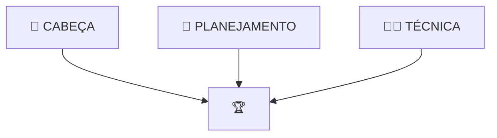

# **GUIA: COMO ESTUDAR PARA FATEC 2025**!
   
Com a mudança da banca que aplica a prova da FATEC que aconteceu em 2025 a forma de se preparar para a FATEC mudou e a ideia desse nosso conteúdo é te explicar como essa mudança de banca impacta no seu processo de estudo e te mostrar os 3 pilares que devem nortear sua preparação para FATEC! 

??? warning "Atenção: Não pule conteúdo"
	Muitas pessoas começam a se preparar para a prova da FATEC faltando apenas algumas semanas para prova e é natural querer correr para assistir apenas o essencial, mas toda a lógica desse conteúdo vai te ajudar na construção do seu plano de estudo, especialmente se você tiver pouco tempo, então evite pular os conteúdos que vamos falar por aqui! 

---
## **Entendendo a mudança**

### **O que gerou essa mudança?**
**DA FAT PARA IDECAN**  
Para quem não sabe até 2024 a instituição responsável pela prova da FATEC era a [Fundação FAT](https://fundacaofat.org.br/). A partir de 2025, isso mudou e a [IDECAN](https://www.idecan.org.br/) passou a ser responsável pela aplicação. 

### **O mudou na prova?**  
O conteúdo cobrado, segundo o edital da FATEC mudou pouco da FAT para IDECAN, no entanto, a maneira como esse conteúdo é cobrada mudou drasticamente, enquanto nas provas da FAT a interpretação era um muito presente, sendo possível acertar muitas questões da prova apenas lendo e interpretando os textos, a IDECAN vem com uma abordagem muito mais focada em conteúdos específicos. 
Essa mudança gerou uma surpresa muito grande para quem foi realizar o vestibular do 1º Semestre de 2025, mas o fato aqui é a prova mudou e a forma de se preparar também!

### **O muda na preparação?**  
Devido a dinâmica da prova antiga da FATEC a preparação que sempre recomendei no canal foi focada em realizar as provas antigas, essa estratégia funcionava muito bem para prova da FAT que tinha muita interpretação, afinal resolver as provas antigas era uma das melhorar formas de treinar interpretação. Com essa nova prova precisamos de um estudo que não foca apenas em interpretação, mas também em aprender os conteúdos que a prova apresenta, e é sobre isso que vamos valar agora

---
## **Como se preparar para nova FATEC**

### **Os 3 pilares da preparação**

A sua preparação para fatec passa por 3 pilares:

- Planejamento

- Técnica

- Cabeça

Aqui a ideia é explicar a lógica por trás de cada um dos três e apresentar para vocês o principio geral de cada um deles! 

---
### **📅 Planejamento**
??? tip "Principio"
	O planejamento só é necessário por que nosso tempo estudando para FATEC não é inifinito.

O pilar de planejamento é o responsável por responder perguntas como: 

- Quantas preciso estudar por dia?

- Quantas horas estudar por matéria?

- Quanto tempo estudar matérias novas? E revisões? E provas antigas?

- Por qual conteúdo começo a estudar Português? E mamtemática? E ...

- Como divido meu tempo se tenho 6 meses pra estudar? E se tenho 1 mes? E uma semana? 

Essas perguntas ajudam a ilustar qual parte do nosso estudo esse pilar cuida, e a resposta para cada uma delas daria um vídeo, mas pra entender a ideia geral você precisa ter duas coisas em mente: 

**1. Comece simples:** Quando falamos de planejamento de estudo as pessoas tendem a querer complicar, com técnicas, métodos, formas de organização que pra quem está começando acabam mais dificultando do que ajudando, então comece da maneira mais simples possível

**2. Kaizen:** Para quem não conhece a filosifia Kaizen fala da melhoria continua e esse deve ser seu foco nos estudos ir melhorando gradualmente seu planejamento, sua organização, suas técnicas e sua mentalidade todo dia! 

---
**COMO COMEÇAR**
Seguindo a filosofia de comecar simples, pegue um papel e uma caneta e faça o seguinte, pensando na semana atual e na próxima semana:

1. **Liste seus compromissos recorrentes** Aquelas coisas que você faz toda semana (Ex: Trabalho, academia, cursos, etc.)

2. **Lista seus compromissos pontuais:** Aqueles compromissos fora da sua rotina que acontecem de vez em quanto (Ex: Médico, viagem, etc.)

3. **Encontre seus horários fixos de estudo:** Esses são os horários que você vai sentar e estudar para FATEC (Idealmente blocos de pelo menos 30 min)

4. **Tente seguir esses horários:** Todo dia anote se você conseguiu ou não seguir os horários e se não conseguiu o motivo, no fim da semana, volte para o passo 1 e olhe como foi sua semana de estudo e tente ajustar o que fez você não conseguir seu plano.

??? tip "Mas o que eu vou estudar?"
	Para começar você vai dividir seu estudo em 1 matéria por dia, e você vai estudar o primeiro tópico do edital da FATEC para essa matéria. 

Essa lógica vai te ajudar a começar o segredo é ir melhorando ela com o passar do tempo se perguntando coisas como:

- Estou conseguindo seguir meu plano? Se não, por que? 

- Qual matéria estou com mais dificuldade? CConsigo aumentar a carga de estudo para a próxima semana? 

- A ordem que está no edital está fazendo sentido ou preciso reorganizar? 

A ideia nesse início é vencer a inercia e adiquirir o hábito de estudar, depois de fazer isso por duas semanas você vai conseguir ver o poder da constância no estudo. 

??? warning "Vale lembrar!"
	Tente estudar pelo menos 1 hora por dia

# Pilares
Entender o processo de estudo
Planejamento
- Quantas horas estudar por dia
- Qual matéria estudar
- Quantas horas estudar por matéria
- Divisão de tempo entre matérias novas x revisão x provas antigas

Aprender a estudar 
- Como entender os conteúdos
- Como aprender os conteúdos
- Como lembrar dos conteúdos

Conseguir estudar
- Como manter o foco
	Não tenha disciplina tenha sistemas
- Como se manter motivado 
- Quais técnicas para evitar a procrastinação

Aprender a estudar 