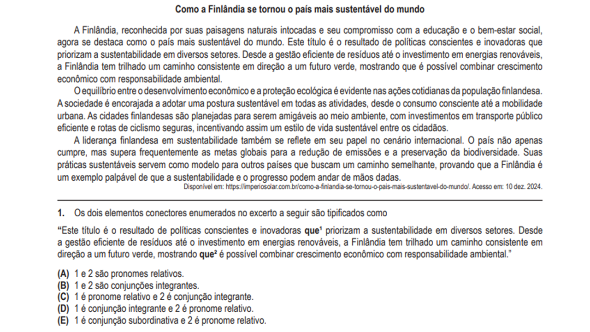

Fatec 2025 - 1º Semestre

# **QUESTÃO 01 - PROVA A**

<small></small>
---

??? tip "Vídeo de resolução da questão"
    Essa questão ainda não tem um vídeo de resolução, mas ele ficará disponível em breve! 
    Fique de olho no canal [FATEC PraGente](https://www.youtube.com/@fatecpragente)

??? warning "Conteúdos da questão"
    [Pronomes relativos  :fontawesome-solid-link:](/materias/portugues/pronomes/pronomes-relativos){ .md-button : target="_blank"}
    [Conjunções integrantes  :fontawesome-solid-link:](/materias/portugues/conjuncoes/conjuncoes-integrantes){ .md-button : target="_blank"}

<small>Confira o canal [FATEC PraGente](https://www.youtube.com/@fatecpragente) para dicas de preparação para prova da FATEC!</small>
